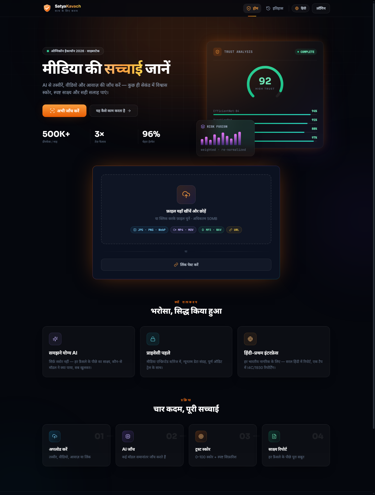
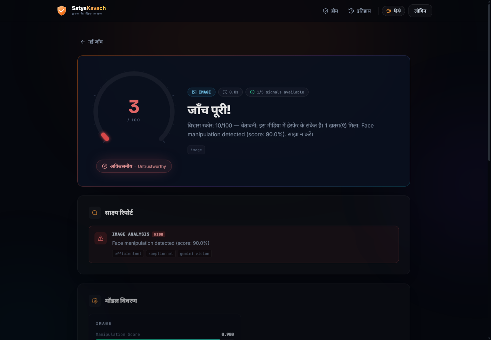
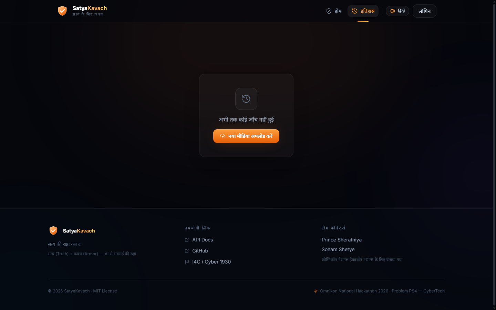
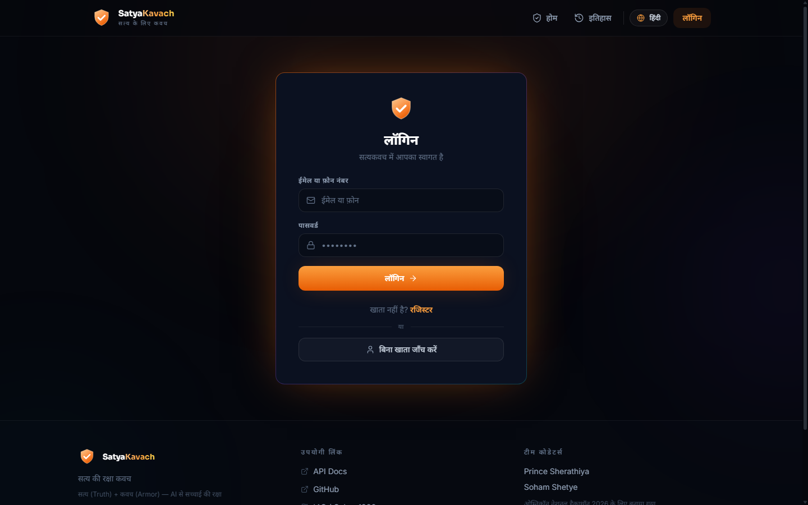
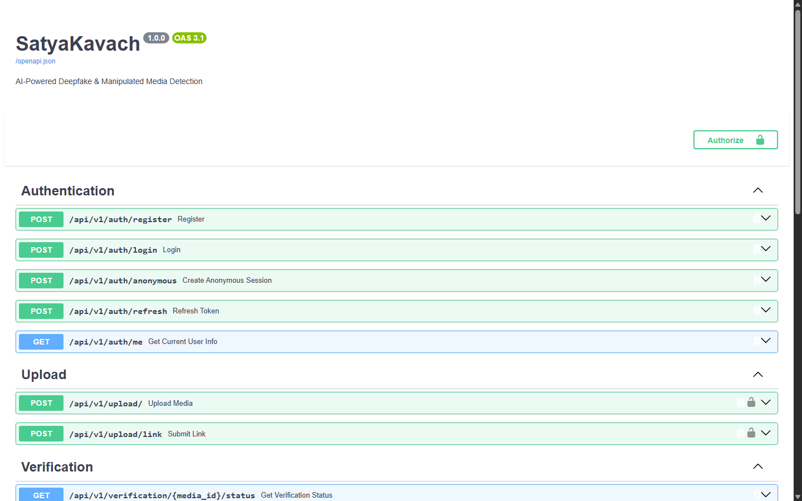
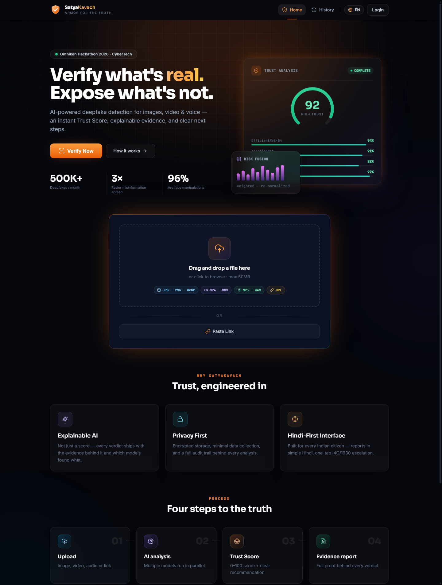
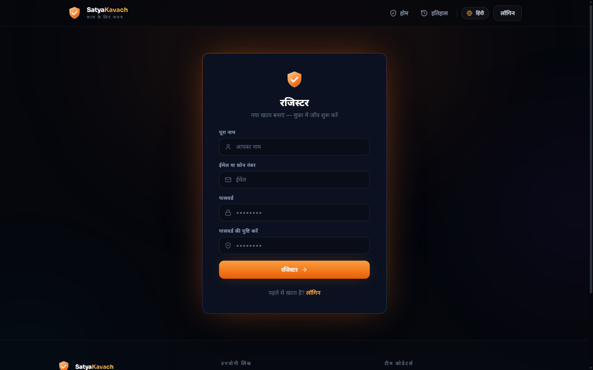

<div align="center">


# 🛡️ SatyaKavach — सत्य कवच

### *Armor for the Truth*

**AI-Powered Deepfake & Manipulated Media Detection Platform**

One unified platform where any citizen can verify images, videos, audio, screenshots, or suspicious links — and receive an explainable Trust Score with evidence-backed recommendations in seconds.

[](https://python.org)
[](https://fastapi.tiangolo.com)
[](https://react.dev)
[](https://typescriptlang.org)
[](https://pytorch.org)
[](https://docker.com)
[](LICENSE)

**Omnikon National Hackathon 2026 · Problem `Omni_CyberTech_4` · Team Codeators**

[🚀 Quick Start](#-quick-start) · [📸 Screenshots](#-screenshots) · [🏛️ Architecture](#%EF%B8%8F-system-architecture) · [🧠 AI Pipeline](#-ai-models--detection-pipeline) · [🔌 API Reference](#-api-reference)

</div>

---

## 📖 Table of Contents

- [The Problem](#-the-problem)
- [The Solution](#-the-solution)
- [Key Features](#-key-features)
- [Screenshots](#-screenshots)
- [System Architecture](#%EF%B8%8F-system-architecture)
- [AI Models & Detection Pipeline](#-ai-models--detection-pipeline)
- [Signal-Level Forensics](#-signal-level-forensics-engine)
- [Risk Engine & Trust Score](#%EF%B8%8F-risk-engine--trust-score)
- [Training Pipeline](#-training-pipeline)
- [Tech Stack](#%EF%B8%8F-tech-stack)
- [Project Structure](#-project-structure)
- [Quick Start](#-quick-start)
- [API Reference](#-api-reference)
- [Testing](#-testing)
- [Demo Mode](#-demo-mode)
- [Deployment](#-deployment-100-free-tier)
- [Roadmap](#%EF%B8%8F-roadmap)
- [Team](#-team)
- [Acknowledgements](#-acknowledgements)

---

## 🚨 The Problem

> *Generative AI can now create **highly realistic fake images, videos, and voices** that are nearly impossible for ordinary users to distinguish from authentic content.*

| ⚠️ Threat | 💥 Impact |
|---|---|
| 📈 **500M+ deepfakes** expected to circulate globally each year | Mass misinformation at unprecedented scale |
| ⚡ Fake media spreads **3× faster** than verified content | Damage done before fact-checkers can respond |
| 🎭 **96%** of deepfakes contain manipulated faces | Impersonation, fraud, blackmail, reputational harm |
| 🧩 Existing detection tools are **fragmented & research-grade** | Ordinary citizens have no accessible way to verify |

**Who faces this?** Social media users · Journalists & fact-checkers · Students & educators · Government institutions — essentially *anyone consuming digital content*.

---

## 💡 The Solution

**SatyaKavach** (सत्य = Truth + कवच = Armor) is a citizen-first AI verification platform that helps people verify suspicious digital content **before they act on it**.

```
Upload anything suspicious → Parallel multimodal AI analysis → One Trust Score → Explainable evidence report (Hindi-first) → Recommended action
```

### What makes it different?

| Pillar | How |
|---|---|
| 🔀 **Multimodal** | Image + Video + Audio + Links verified in one platform |
| 🔍 **Explainable** | Every verdict ships with evidence artifacts and per-model findings — never a black-box score |
| 🎯 **Action-oriented** | Clear recommendation: verify / do not share / report to **I4C / Cyber 1930** |
| 🇮🇳 **Hindi-first** | Full bilingual UI designed for Bharat-first adoption |
| 🛡️ **Privacy-first** | Encrypted storage, SHA-256 deduplication, immutable audit trail |
| 🧠 **Trained Models** | EfficientNet-B4 + XceptionNet trained on 20K balanced dataset with gradient accumulation |

---

## ✨ Key Features

| # | Feature | Status | Description |
|---|---|---|---|
| F1 | 📤 Multimodal Upload | ✅ Built | Drag-&-drop images/video/audio, screenshots, or paste a link |
| F2 | 🖼️ Image Deepfake Detection | ✅ Built | EfficientNet-B4 + XceptionNet ONNX ensemble + signal-level forensics |
| F3 | 🎬 Video Deepfake Detection | ✅ Built | Keyframe extraction → temporal analysis → frame-level detection |
| F4 | 🎙️ Voice Clone Detection | ✅ Built | Whisper transcription + Wav2Vec2 + spectrogram analysis |
| F5 | 🔬 Media Forensics Engine | ✅ Built | ELA, JPEG Ghost, frequency analysis, noise patterns |
| F6 | 📊 Metadata Forensics | ✅ Built | EXIF analysis, editing software detection, timestamp anomalies |
| F7 | 📱 Screenshot Analysis | ✅ Built | Screenshot-specific artifact detection |
| F8 | 🌐 Threat Intelligence | ✅ Built | VirusTotal + Google Safe Browsing + PhishTank + domain reputation |
| F9 | ⚖️ Unified Trust Score | ✅ Built | Weighted risk fusion → 0–100 score + 3-tier verdict |
| F10 | 📋 Explainable Evidence Report | ✅ Built | Gemini-written, cites artifacts, Hindi-first templates |
| F11 | 🚨 Recommended Action | ✅ Built | Verify / do-not-share guidance incl. I4C/1930 reporting |
| F12 | 🔐 Accounts & History | ✅ Built | JWT auth, RBAC roles, anonymous sessions, verification history |
| F13 | 📱 Hindi-First PWA | ✅ Built | Installable, mobile-first, offline-tolerant UI |

---

## 📸 Screenshots

<table>
<tr>
<td width="50%">

<p align="center"><strong>हिंदी लैंडिंग पेज</strong> — cinematic hero, live stats, upload zone</p>
</td>
<td width="50%">

<p align="center"><strong>Verification Results</strong> — animated Trust Score gauge, verdict badge, model breakdown bars, evidence artifacts</p>
</td>
</tr>
<tr>
<td width="50%">

<p align="center"><strong>Verification History</strong> — past scans with scores & verdicts</p>
</td>
<td width="50%">

<p align="center"><strong>Authentication</strong> — secure JWT sessions (+ anonymous mode)</p>
</td>
</tr>
<tr>
<td colspan="2">

<p align="center"><strong>Interactive API Documentation</strong> — auto-generated OpenAPI/Swagger at <code>/docs</code></p>
</td>
</tr>
</table>

<details>
<summary><strong>More screenshots</strong> (click to expand)</summary>

| | |
|---|---|
|  | *English landing page* |
|  | *Account registration* |

</details>

---

## 🏛️ System Architecture

```
┌───────────────────────────────────────────────────────────────────────┐
│                     1 · PRESENTATION LAYER                            │
│        React 18 + TypeScript PWA · Hindi-first · Tailwind CSS         │
└──────────────────────────────┬────────────────────────────────────────┘
                               │ REST API · JWT
┌──────────────────────────────▼────────────────────────────────────────┐
│                 2 · BACKEND & ORCHESTRATION                           │
│   FastAPI · Upload validation · Async job pipeline · RBAC · Audit     │
└───────┬──────────────────────────────┬────────────────────────────────┘
        │                              │
┌───────▼───────────────┐   ┌──────────▼───────────────────────────────┐
│  3 · AI & INTELLIGENCE │   │  4 · DATA LAYER                          │
│  ───────────────────── │   │  ───────────────────────────────────────  │
│  Image Detectors       │   │  PostgreSQL — users·uploads·verdicts     │
│  Video Pipeline        │   │  S3/R2/Local — encrypted evidence store  │
│  Audio Analysis        │   │  Threat Intel Cache — TTL'd results      │
│  OCR + Scam Classifier │   │  Audit Logs — immutable event trail      │
│  Gemini 2.5 Reasoning  │   │                                          │
│  Signal Forensics      │   │                                          │
└───────┬───────────────┘   └──────────────────────────────────────────┘
        │
┌───────▼───────────────────────────────────────────────────────────────┐
│                    5 · THREAT INTELLIGENCE                             │
│      VirusTotal · Google Safe Browsing · PhishTank · Domain Rep        │
└────────────────────────────────────────────────────────────────────────┘

  🔒 SECURITY FIRST — HTTPS · JWT · input validation · magic-byte checks
  ☁️  CLOUD READY    — Docker Compose · Nginx · stateless APIs
  🧠 TRAINED MODELS  — EfficientNet-B4 + XceptionNet (ONNX, 20K dataset)
```

### Request Lifecycle

```
POST /api/v1/upload/
  ├─ 1. Validate size ≤ 100MB, MIME type allow-list, SHA-256 dedup cache
  ├─ 2. Store original in object storage (S3/R2/local fallback)
  ├─ 3. Preprocess: face detect/crop, keyframe extraction, spectrograms
  ├─ 4. Fan-out parallel analysis:
  │       image → EfficientNet ∥ XceptionNet ∥ ELA ∥ Ghost ∥ Freq ∥ Noise
  │       video → frame sampling → temporal models
  │       audio → Whisper transcript ∥ spectrogram ∥ Wav2Vec2
  │       link  → threat intel vendors (with TTL cache)
  │       meta  → EXIF forensics + screenshot analysis
  ├─ 5. Risk Engine fuses available signals (weights re-normalized)
  ├─ 6. Gemini writes the explainable evidence report (Hindi + English)
  └─ 7. Persist verdict + audit log → return Trust Score
```

---

## 🧠 AI Models & Detection Pipeline

| Modality | Models | Datasets for Validation | Output |
|---|---|---|---|
| 🖼️ **Image** | EfficientNet-B4 · XceptionNet · ELA · JPEG Ghost · Freq Analysis · Noise Pattern | FaceForensics++, Celeb-DF v2, DFDC | Manipulation score · fake/real class · forensic artifacts |
| 🎬 **Video** | Keyframe extraction · temporal consistency · frame-level analysis | FaceForensics++, DFDC, DeepFakeTIMIT | Frame-level detection · authenticity score |
| 🎙️ **Audio** | Whisper · Wav2Vec2 · spectrogram CNN | ASVspoof 2019, FakeAVCeleb, WaveFake | Voice-clone detection · authenticity score |
| 🔬 **Forensics** | EXIF metadata · editing software detection · thumbnail consistency | — | Editing risk score · device fingerprint · timestamp anomalies |
| 🧩 **Fusion** | Weighted Risk Engine + Gemini 2.5 reasoning | — | Trust Score · evidence report · final verdict |

### Image Detection Pipeline

```
Upload Image → OpenCV Face Detection → Crop & Align Faces
                                           │
                    ┌──────────────────────┬┴──────────────────────┐
                    │                      │                       │
              EfficientNet-B4         XceptionNet           Signal Forensics
              (ONNX, 0.55 wt)        (ONNX, 0.45 wt)       (4-channel analysis)
                    │                      │                       │
                    └──────────┬───────────┘                       │
                               │                                   │
                    Weighted Ensemble                    ELA + Ghost + Freq + Noise
                    (per-face fusion)                     (corroborative evidence)
                               │                                   │
                               └───────────────┬───────────────────┘
                                               │
                                    Detection Threshold (0.46)
                                    Classification: fake / real
                                    Confidence + Forensic Corroboration
```

### Model Weights

| Model | Format | Location | Status |
|---|---|---|---|
| EfficientNet-B4 | ONNX | `backend/app/services/ai/model_weights/efficientnet_b4_deepfake.onnx` | ✅ Trained (20K balanced dataset) |
| XceptionNet | ONNX | `backend/app/services/ai/model_weights/xception_deepfake.onnx` | ✅ Trained |
| PyTorch checkpoints | `.pth` | `training/models/efficientnet_b4/`, `training/models/xception/` | ✅ Available |

---

## 🔬 Signal-Level Forensics Engine

Beyond neural network inference, SatyaKavach runs **four signal-level forensic analyses** on every image — providing corroborative evidence independent of the trained models:

| Analysis | What It Detects | Method |
|---|---|---|
| **Error Level Analysis (ELA)** | Manipulated regions with inconsistent compression | Re-saves at Q90, measures pixel-difference std deviation |
| **JPEG Ghost Detection** | Double-compression artifacts from splicing | Re-encodes at Q70/80/90/95, checks non-linear ghost patterns |
| **Frequency Domain Analysis** | GAN upscaling artifacts in high-frequency energy | 2D DCT via FFT, high-frequency energy ratio + spectral centroid |
| **Sensor Noise Pattern (PRNU)** | Inconsistent noise in deepfakes vs. real camera photos | High-pass filter extraction, noise std deviation analysis |

```
Forensic Score = 0.30 × ELA + 0.25 × Ghost + 0.25 × Frequency + 0.20 × Noise

Corroboration: When forensics agree with the ONNX model verdict,
               confidence is boosted by +0.10 for borderline cases.
```

---

## ⚖️ Risk Engine & Trust Score

Signals are fused using configurable weights, **re-normalized over whichever signals are actually available** — so one failing analyzer never blocks a verdict:

```python
risk = Σ(weightᵢ × signalᵢ) / Σ(weightᵢ over available signals)

RISK_WEIGHT_IMAGE   = 0.30    # EfficientNet + XceptionNet + forensics
RISK_WEIGHT_VIDEO   = 0.25    # TimeSformer + Video Swin
RISK_WEIGHT_AUDIO   = 0.20    # Wav2Vec2 + spectrogram + Whisper
RISK_WEIGHT_OCR_NLP = 0.15    # EasyOCR + scam-message classifier
RISK_WEIGHT_THREAT  = 0.10    # VirusTotal + Safe Browsing + PhishTank
```

| Trust Score | Verdict | Meaning |
|---|---|---|
| `80 – 100` | 🟢 `HIGH_TRUST` | No manipulation signals found — likely authentic |
| `50 – 79` | 🟡 `UNCERTAIN` | Mixed signals — verify manually before sharing |
| `0 – 49` | 🔴 `LOW_TRUST` | High manipulation risk — do not share, consider reporting |

### Metadata & Screenshot Forensics

| Analyzer | Capabilities |
|---|---|
| **EXIF Metadata** | Editing software detection (Photoshop, DeepFaceLab, Midjourney, etc.), timestamp anomaly detection, thumbnail vs. full-image consistency, device fingerprint analysis |
| **Screenshot Analysis** | Screenshot-specific artifact detection, UI element consistency, compression pattern analysis |

---

## 🧪 Training Pipeline

SatyaKavach includes a complete training pipeline for deepfake detection models, designed for **consumer GPU training** (6GB VRAM):

### Dataset

| Split | Real | Fake | Total |
|---|---|---|---|
| **Train** | 10,000 | 10,000 | 20,000 |
| **Validation** | 1,000 | 1,000 | 2,000 |
| **Test** | 1,000 | 1,000 | 2,000 |
| **Total** | 12,000 | 12,000 | 24,000 |

**Data Sources:** 140K Real-and-Fake-Faces (HuggingFace) + Celeb-DF v2 → balanced to 1:1 class ratio.

### Training Configuration

| Parameter | EfficientNet-B4 | XceptionNet |
|---|---|---|
| **Batch size** | 8 | 8 |
| **Gradient accumulation** | 4 steps | 4 steps |
| **Effective batch** | 32 | 32 |
| **Epochs** | 25 | 30 |
| **Learning rate** | 1e-4 | 1e-4 |
| **Scheduler** | Cosine annealing | Cosine annealing |
| **Mixed precision** | FP16 (AMP) | FP16 (AMP) |
| **Label smoothing** | 0.1 | 0.1 |
| **Early stopping** | 5 epochs patience | 5 epochs patience |
| **Weight decay** | 1e-4 | 1e-4 |
| **Detection threshold** | 0.46 (tuned) | — |
| **Export format** | ONNX | ONNX |

### Launch Training

```bash
# Build balanced 10K/class dataset
python -m training.scripts.build_balanced_dataset

# Train EfficientNet (batch_size=8, accum=4)
python -m training.scripts.train_efficientnet --batch-size 8 --accum-steps 4 --epochs 25

# Train XceptionNet
python -m training.scripts.train_xception --batch-size 8 --accum-steps 4 --epochs 30
```

Models are automatically exported to ONNX and copied to `backend/app/services/ai/model_weights/`.

---

## 🛠️ Tech Stack

| Layer | Technologies |
|---|---|
| **Frontend** | React 18 · TypeScript · Tailwind CSS · Vite · React Router · Axios · PWA (service worker) |
| **Backend** | Python 3.11 · FastAPI · Uvicorn · SQLAlchemy 2 (async) · Pydantic v2 |
| **Auth** | JWT access+refresh tokens · bcrypt hashing · RBAC roles (`citizen → admin`) · anonymous sessions |
| **Database** | PostgreSQL 16 (prod) · SQLite async fallback (dev) · Alembic-ready |
| **Storage** | AWS S3-compatible (S3/R2/MinIO) · automatic local-disk dev fallback |
| **AI/ML** | PyTorch 2.x · ONNX Runtime · EfficientNet-B4 · XceptionNet · OpenCV · NumPy · SciPy |
| **Forensics** | ELA · JPEG Ghost · DCT/Frequency · PRNU Noise · EXIF Metadata · EasyOCR |
| **AI Reasoning** | Gemini 2.0 Flash (evidence reports, Hindi-first) |
| **Threat Intel** | VirusTotal API · Google Safe Browsing · PhishTank · TTL result cache |
| **Infra** | Docker Compose (api · postgres · minio · redis · nginx) · Celery workers |

---

## 📂 Project Structure

```
satyakavach/
├── backend/
│   ├── app/
│   │   ├── main.py                    # FastAPI app factory + lifespan
│   │   ├── core/
│   │   │   ├── config.py              # Typed settings (pydantic-settings)
│   │   │   ├── database.py            # Async SQLAlchemy engine & sessions
│   │   │   ├── security.py            # JWT · bcrypt · RBAC helpers
│   │   │   └── storage.py             # S3 storage w/ local dev fallback
│   │   ├── models/                    # User · MediaUpload · VerificationRecord
│   │   │                              # AuditLog · ThreatCache
│   │   ├── schemas/                   # Pydantic request/response models
│   │   ├── api/v1/
│   │   │   ├── auth.py                # register · login · anonymous · refresh
│   │   │   ├── upload.py              # POST /upload · /upload/link
│   │   │   ├── verification.py        # status · result · history
│   │   │   └── deps.py                # Auth dependencies
│   │   └── services/
│   │       ├── ai/
│   │       │   ├── image_detector.py  # ⭐ EfficientNet + XceptionNet + ELA/Ghost/Freq/Noise
│   │       │   ├── video_detector.py  # Frame-level temporal analysis
│   │       │   ├── audio_detector.py  # Wav2Vec2 + spectrogram analysis
│   │       │   ├── gemini_evidence.py # Gemini 2.5 evidence report generation
│   │       │   └── model_weights/     # Trained ONNX models (.onnx)
│   │       ├── preprocessing/
│   │       │   └── pipeline.py        # Face detection, keyframes, audio extraction
│   │       ├── forensics/
│   │       │   ├── metadata_analyzer.py   # EXIF forensics + editing detection
│   │       │   └── screenshot_analyzer.py # Screenshot artifact detection
│   │       ├── threat_intel/
│   │       │   ├── service.py         # Multi-vendor reputation service
│   │       │   └── page_analyzer.py   # Page-level content analysis
│   │       ├── risk_engine.py         # ⭐ Weighted signal fusion → Trust Score
│   │       └── verification.py        # Pipeline orchestrator
│   └── tests/
│       ├── unit/                      # Risk engine + detector unit tests
│       ├── property/                  # Hypothesis property-based tests
│       └── integration/               # End-to-end pipeline tests
├── frontend/
│   ├── src/
│   │   ├── components/                # Navbar · TrustGauge · FileUpload · Icons · ErrorBoundary
│   │   ├── pages/                     # Home · Results · History · Login · Register
│   │   ├── i18n/translations.ts       # Full हिंदी ⇄ EN dictionary
│   │   ├── services/api.ts            # Typed axios client + auto-anonymous auth
│   │   ├── hooks/                     # Custom React hooks
│   │   └── types/index.ts             # Shared TypeScript interfaces
│   └── public/                        # PWA manifest · icons · service worker
├── training/
│   ├── configs/train_config.py        # Hyperparameters & dataset paths
│   ├── scripts/
│   │   ├── train_efficientnet.py      # EfficientNet-B4 training with gradient accumulation
│   │   ├── train_xception.py          # XceptionNet training
│   │   ├── build_balanced_dataset.py  # Creates 10K/class balanced splits
│   │   ├── download_real_datasets.py  # Downloads 140K + Celeb-DF datasets
│   │   └── export_models.py           # PyTorch → ONNX export
│   └── datasets/                      # Downloaded & balanced datasets
├── nginx/nginx.conf                   # Reverse proxy + rate limiting
├── docker-compose.yml                 # api · postgres · minio · redis · nginx
├── docs/screenshots/                  # Product screenshots
├── design.md                          # Full system design (~1,800 lines)
├── requirements.md                    # FR/NFR specifications
├── features.md                        # Feature catalogue & traceability
├── roadmap.md                         # Delivery phases A → C+
└── API_KEYS_GUIDE.md                  # Free-tier key setup walkthrough
```

---

## 🚀 Quick Start

### Prerequisites

| Tool | Version |
|---|---|
| Python | 3.11+ |
| Node.js | 18+ |
| Docker *(optional)* | any recent |

### Option A — Local Development (No Docker Needed)

**1 · Backend**

```bash
cd backend
pip install -r requirements.txt

cp .env.example .env        # add your GEMINI_API_KEY (free @ ai.google.dev)

# Run with SQLite for instant local setup (no Postgres required):
DATABASE_URL="sqlite+aiosqlite:///./satya.local.db" uvicorn app.main:app --reload --port 8000
```

> ✅ The backend auto-creates tables, falls back to local-disk media storage when MinIO isn't running, and serves Swagger docs at [`http://localhost:8000/docs`](http://localhost:8000/docs).

**2 · Frontend**

```bash
cd frontend
npm install
npm run dev                 # → http://localhost:5173 (proxies /api → :8000)
```

### Option B — Full Stack with Docker Compose

```bash
docker-compose up --build
# frontend  → http://localhost
# api       → http://localhost:8000
# minio     → http://localhost:9001
```

### Option C — Train Your Own Models

```bash
# Install training dependencies
pip install -r training/requirements.txt

# Download datasets (140K + Celeb-DF)
python -m training.scripts.download_real_datasets

# Build balanced 10K/class splits
python -m training.scripts.build_balanced_dataset

# Train EfficientNet (RTX 3050 6GB compatible)
python -m training.scripts.train_efficientnet --batch-size 8 --accum-steps 4 --epochs 25

# Train XceptionNet
python -m training.scripts.train_xception --batch-size 8 --accum-steps 4 --epochs 30
```

<details>
<summary><strong>⚙️ Environment Variables</strong> (backend/.env)</summary>

| Variable | Required | Description |
|---|---|---|
| `GEMINI_API_KEY` | recommended | Enables real Gemini Vision + evidence reports ([free key](https://ai.google.dev)) |
| `DEMO_MODE` | no | `true` → realistic mock AI scores; full flow needs zero keys |
| `DATABASE_URL` | no | Defaults to Docker Postgres; use SQLite locally (see above) |
| `JWT_SECRET_KEY` | prod | Change in production! |
| `VIRUSTOTAL_API_KEY` | optional | Live URL/file reputation (4 req/min free) |
| `GOOGLE_SAFE_BROWSING_API_KEY` | optional | Phishing URL checks (10k/day free) |
| `PHISHTANK_APP_KEY` | optional | Phishing database lookups |
| `S3_ENDPOINT` · `S3_ACCESS_KEY` · `S3_SECRET_KEY` | no | Object storage; local disk used when unreachable |

Full walkthrough: **[API_KEYS_GUIDE.md](API_KEYS_GUIDE.md)**

</details>

---

## 🔌 API Reference

Base URL: `/api/v1` · Interactive docs: `/docs` (Swagger) · `/redoc`

| Method | Endpoint | Description |
|---|---|---|
| `POST` | `/auth/register` | Create account (email/phone + password) |
| `POST` | `/auth/login` | Obtain JWT access token |
| `POST` | `/auth/anonymous` | Instant guest session — zero friction |
| `POST` | `/upload/` | Multipart media upload → starts verification |
| `POST` | `/upload/link` | Submit suspicious URL for threat intel |
| `GET` | `/verification/{id}/status` | Job progress polling |
| `GET` | `/verification/{id}/result` | Full verdict: score · breakdown · evidence |
| `GET` | `/verification/history` | Paginated scan history (auth) |
| `GET` | `/health` | Service heartbeat |

### Example — Verify an Image

```bash
curl -X POST http://localhost:8000/api/v1/upload/ \
  -F "file=@suspicious_photo.jpg" \
  -F "language=hi"
```

```json
{
  "media_id": "7e2b0ff8-7063-4b3e-8932-e5604ceb50b4",
  "media_type": "image",
  "status": "complete",
  "message": "Verification complete"
}
```

### Example — Full Verdict Response

```json
{
  "trust_score": 10,
  "verdict": "LOW_TRUST",
  "recommended_action": "High risk of manipulation detected. Do not share this media. Report to I4C/1930 if applicable.",
  "model_breakdown": {
    "image": {
      "manipulation_score": 0.9,
      "classification": "fake",
      "confidence": 0.85,
      "models_used": ["efficientnet", "xception", "ela", "jpeg_ghost", "frequency", "noise"],
      "forensic_score": 0.72,
      "forensic_corroborates": true,
      "total_faces_detected": 1,
      "faces_classified_fake": 1,
      "artifacts": [
        "High-confidence manipulation detected across multiple models",
        "Strong inter-model agreement on manipulation detection",
        "Inconsistent facial features detected by ensemble analysis"
      ]
    }
  },
  "evidence_report": {
    "summary_hi": "विश्वास स्कोर: 10/100 — चेतावनी: इस मीडिया में हेरफेर के संकेत हैं।",
    "findings": [...]
  }
}
```

---

## 🧪 Testing

```bash
cd backend
pytest tests/unit -v          # Risk engine & detector unit tests
pytest tests/property -v      # Hypothesis property-based correctness invariants
pytest tests/integration -v   # End-to-end pipeline tests
pytest tests/ -v              # Everything
```

**What property tests guarantee:**
- Trust scores always within `[0, 100]`
- Weights always sum to `1.0` after re-normalization
- Verdict thresholds are monotonic (higher score → better verdict)
- Empty signals → UNCERTAIN default (never crashes)

---

## 🎭 Demo Mode

Perfect for judges & quick demos — **no API keys required:**

| Setting | Behaviour |
|---|---|
| `DEMO_MODE=true` (default) | Realistic deterministic mock scores from every detector + full evidence reports |
| Add `GEMINI_API_KEY` | Reports become genuinely AI-generated while scores stay mocked |
| Production swap | Each detector is a swappable service — GPU inference drops in without touching orchestration |

---

## 🚢 Deployment (100% Free Tier)

| Component | Provider | Free Tier |
|---|---|---|
| Frontend PWA | **Vercel / Netlify** | Unlimited static hosting + CDN |
| Backend API | **Render** | 750 hrs/month web service |
| Database | **Neon** | 0.5 GB serverless Postgres |
| Media Storage | **Cloudflare R2** | 10 GB, zero egress fees |
| AI Reasoning | **Google AI Studio** | Generous daily Gemini limits |
| Heavy Models (optional) | **HF Spaces** | 2 vCPU · 16 GB RAM |

---

## 🗺️ Roadmap

| Phase | Timeline | Scope |
|---|---|---|
| ✅ **A — Hackathon MVP** | Done | Multimodal detection · Signal forensics · Risk Engine · Evidence reports · Hindi PWA · Trained ONNX models |
| 🔄 **B — Public Pilot** | Next 30 days | Free-stack deployment · OCR scam classifier · I4C/1930 reporting flow · Browser extension |
| 🔭 **C — Scale** | 3–12 months | WhatsApp bot intake · Admin dashboard · Regional languages · Real-time video verification |
| 🚀 **C+ — Platform** | 12+ months | Trend monitoring · Gov partnerships · Mobile app · Multi-language support |

---

## 👥 Team Codeators

| Member | Role |
|---|---|
| **Prince Sherathiya** | Full-stack & AI engineering — architecture, models, backend, frontend |
| **Soham Shetye** | Product, research & testing — UX, feature design, QA |

*Built for the Omnikon National Hackathon 2026 — Problem `Omni_CyberTech_4` (CyberTech).*

---

## 🙏 Acknowledgements

- **Datasets:** [FaceForensics++](https://github.com/ondyari/FaceForensics) · [DFDC](https://ai.meta.com/datasets/dfdc) · [Celeb-DF v2](https://cse.buffalo.edu/~siweilyu/celeb-deepfakeforensics.html) · [140K Real-and-Fake-Faces](https://huggingface.co/datasets/TheKernel01/140k-Real-and-Fake-Faces) · [ASVspoof 2019](https://www.asvspoof.org) · FakeAVCeleb · WaveFake · DeepFakeBench
- **Threat Intelligence:** [VirusTotal](https://www.virustotal.com) · [Google Safe Browsing](https://safebrowsing.google.com) · [PhishTank](https://phishtank.org)
- **AI Platform:** [Gemini API](https://ai.google.dev) · [HuggingFace](https://huggingface.co) · [PyTorch](https://pytorch.org) · [ONNX Runtime](https://onnxruntime.ai)

---

## 📜 License

Released under the MIT License — see [LICENSE](LICENSE).

---

<div align="center">

**सत्य की रक्षा कवच** · *Armor for the Truth*

⭐ Star this repo if you believe in verifiable media!

</div>
